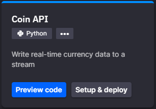
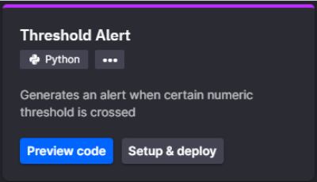
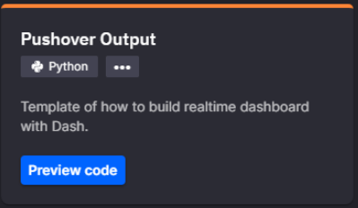

# Currency alerting

In this tutorial you will learn how to build a real-time streaming pipeline that sends push notifications to your phone when the Bitcoin price reaches a certain threshold.

## Learning objectives

In this tutorial you will learn:

* How to use an existing library item to interface Quix to a real-time event stream. In this tutorial this is a stream of trading data from CoinAPI.
* How to create a transformation. 
* How to use an existing library item to interface Quix to a mobile device.

## Getting help

If you need assistance with this tutorial, or have any general questions, please reach out to Quix, we’ll be more than happy to help. We can be found on our public Slack channel, [The Stream](https://quix.ai/slack-invite){target=_blank}. Please sign up, and introduce yourself!

## Prerequisites

To complete this tutorial you will need the following accounts:

* [Quix](https://quix.io){target=_blank} - You can sign up for a free account [here](https://portal.platform.quix.ai/self-sign-up){target=_blank}. This enables you to create the real-time stream processing pipeline.
* [CoinAPI](https://coinapi.io){target=_blank} - You can sign up for a free API key [here](https://www.coinapi.io/Pricing){target=_blank}. On the free tier, click the `GET A FREE API KEY` button, enter the requested information, and you will receive an email containing your API key. This enables you to access a stream of constantly updated BTC/USD exchange rate data.
* [Pushover](https://pushover.net){target=_blank} - You can sign up for a free account [here](https://pushover.net/signup){target=_blank}. Enter your details, and click `Signup`. You will receive a welcome email, and you can log in to Pushover to retrieve your user key and generate an API token. This enables you to send notifications to your phone. Install the Pushover mobile app from the [Apple App store](https://apps.apple.com/us/app/pushover-notifications/id506088175){target=_blank} or [Google Play](https://play.google.com/store/apps/details?id=net.superblock.pushover&hl=en){target=_blank}.

## The pipeline you will create

The objective of this tutorial is to create a pipeline that resembles the following example:

The colors describe the role of the microservice that is being deployed. The possible roles are as follows:

* :blue_square: Source — enables streaming of data into the Quix platform from any external source, such as an API or websocket.
* :purple_square: Transformation — implements the processing of data, for example, cleaning data or implementing a Machine Learning (ML) model.
* :orange_square: Destination — enables streaming of processed data to an external destination, such as a database or dashboard.

## Setting up the CoinAPI source

In this section you will learn how to set up the source library item and deploy it in your pipeline as a microservice.

This library item, when deployed as a microservice in the Quix pipeline, connects a live stream of updates for the currency pair: `BTC/USD`. This real-time exchange rate data is streamed in from the [CoinAPI](https://www.coinapi.io/){target=_blank} through its [Websocket](https://en.wikipedia.org/wiki/WebSocket){target=_blank} interface. The free [sandbox version](https://docs.coinapi.io/#endpoints-2){target=_blank} is used for the purposes of this tutorial. 

To summarize this functionality:

* The microservice streams the exchange rate data to a topic called `currency-exchange-rates`. 
* Downstream microservices in the pipeline can then read fom the `currency-exchange-rates` topic and process it in different ways. In this tutorial, you will check the current Bitcoin price against a threshold.

To set up the CoinAPI source, follow these steps:

1. In the [Quix Portal](https://portal.platform.quix.ai/){target=_blank}, click the `Library` icon in the main left-hand navigation.

2. In the search box on the library page, enter "CoinAPI - Exchange Rate Feed".
   
   You will see the Coin API library item appear in the search results: 

3. Click the `Preview code` button, and on the page that appears, click the `Edit code` button. When you choose to edit a library item, Quix prompts you to create a copy of it as a project, as library items are read-only.

      Optionally, you could have clicked the `Setup & deploy` button, which would have deployed the microservice directly. However, in this tutorial, you are given the opportunity to first look at the code, and modify it if necessary.

4. In the `Setup project` form, configure the following environment variables:

    | Field | Value |
    | --- | --- |
    | `Name` | Enter a project name or keep the default suggestion. |
    | `output` | Select the output topic. In this case, select `currency-exchange-rates` from the list. |
    | `coin_api_key` | The API key that you use to access CoinAPI. |
    | `asset_id_base` | The short code for the _base_ currency that you want to track, for example BTC. |
    | `asset_id_quote`  | The short code for the _target_ currency in which prices will be quoted, for example, USD. |

5. Click `Save as project`. You now have a copy of the CoinAPI library item in your workspace.

6. Click the `Deploy` button. The library item is deployed as a service and automatically started.

      Once the library item has been deployed, you’ll be redirected to the workspace home page, where you can see the service in the pipeline context, as was illustrated previously.

7. Click the CoinAPI service card to inspect the logs:

   

A successful deployment will resemble the following example:

If there is an issue with the service, you can also inspect the `build logs` in the `Lineage` panel to check for any traces of a syntax error or other build issues.

## Setting up the Threshold Alert transformation

In this section you will learn how to implement a microservice that will compare data in the BTC/USD exchange rate stream against a specific price threshold. 

This microservice contains a simple algorithm that checks to see if a value has crossed a threshold in either direction.

The data stream is transformed from a series of real-time price points into a series of price alerts.

To summarize this functionality:

* When the threshold criteria are met, the microservice writes an alert message to a topic called `currency-rate-alerts`. 
* Downstream services can then read fom this topic and send alerts and notifications whenever they detect a new message.

To set up the Threshold Alert item, follow these steps:

1. Click on the Library icon in the left-hand navigation.
2. In the search box on the library page, enter "Threshold Alerts".
   
      You will see the `Threshold Alert` library item appear in the search results: 
      
      

3. Click the `Preview code` button, and on the page that appears, click the `Edit code` button.

4. In the `Setup project` form, set the following environment variables:
      
    | Field | Value |
    | --- | --- |
    | `Name` | As usual, enter a project name or keep the default suggestion. |
    | `input` | Select the input topic. In this case, select `currency-exchange-rates` from the list. |
    | `output` | Select the output topic. In this case, select `currency-rate-alerts` from the list. |
    | `parameterName` | Set this to `PRICE`. |
    | `thresholdValue` | The price in USD that you'd like to get alerted about. For example, on the day that this tutorial was written, BTC was hovering around $16,300 so we entered `16300`. This increases the likelihood that some alerts are generated soon after deploying (otherwise it's hard to tell if it's working). |
    | `msecs_before_recheck` | Enter the minimum delay in milliseconds between alerts. The default is 300 milliseconds (5 minutes), as this prevents numerous alerts when the price hovers around the threshold. |

5. Click `Save as project`. 

      You now have a copy of the Threshold Alert library item in your workspace.

6. Click the `Deploy` button. 

      The library item is deployed as a service and automatically started. Once the microservice has been deployed, you'll be redirected to the pipeline view. 

7. Click the Threshold Alert service card to inspect the logs.

A successful deployment will resemble the following screenshot:

In the `Lineage` panel, you will notice that the two services are connected by a line, which indicates that they're both using the same topic, `currency-exchange-rates`. The CoinAPI service is _writing_ to `currency-exchange-rates`, and the Threshold Alert service is _reading_ from it.

If there is an issue with the service, you can inspect the `build logs` in the `Lineage` panel, to check for any traces of a syntax error or other build issues.

## Setting up the Pushover destination

In this section you create a destination microservice that sends a push notification when a threshold alert condition occurs.

This microservice reads from the `currency-rate-alerts` topic and whenever a new message arrives, it sends a push notification to the Pushover app on your mobile phone.

It also reads the contents of the message and enriches the notification with details on how the threshold was crossed, that is, whether the price is moving up or down.

To set up the push nonfiction microservice, follow these steps:

1. Click on the Library icon in the left-hand navigation.

2. In the search box on the library page, enter "Pushover".
   
      You will see the `Threshold Alert` library item appear in the search results: 
      
      

3. Click the `Preview code` button, and on the page that appears, click the `Edit code` button.

4. On the `Project Creation` page, complete the following fields:
   
    | Field | Value |
    | --- | --- |
    | `Name` | Enter a project name or keep the default suggestion. |
    | `Input` | Select the input topic. In this case, select `currency-rate-alerts` from the list.Every message will be read from this topic, and turned into a push notification. |
    | `base_url` | Leave the default value, `https://api.pushover.net/1/messages.json?`. If you decide to use another push notification app, your can always update this value. |
    | `api_token` | Enter the API token that you generated for this application in your Pushover dashboard. For example: `azovmnbxxdxkj7j4g4wxxxdwf12xx4`. |
    | `user_key` | Enter the user key that you received when you signed up with Pushover. For example: `u721txxxgmvuy5dxaxxxpzx5xxxx9e`) |

5. Click the `Save as project`. You now have a copy of the Pushover notification library item in your workspace.

6. Click the `Deploy` button.

You will now start receiving Pushover notifications on your phone, as shown here:

{width=60%}

Depending on your threshold value and the price fluctuations, it might take a few minutes for you to get a notification. While you are waiting to receive a notification, you can inspect the logs, as shown previously.

* Don't worry if the logs only show "_Listening to Stream_" initially — remember that the Threshold service only writes a message to the `currency-rate-alerts` topic when the threshold has been crossed.
* This means that the `currency-rate-alerts` stream might be empty for a short while.
* Depending on your threshold, it might take a couple of minutes for messages to start arriving.

You've now completed the tutorial. 

## Summary

Here's what you accomplished in this tutorial:

✅ You created a real-time web app, hosted on the Quix serverless compute environment.

✅ You deployed three real-time serverless microservices: the CoinAPI source to read data from another platform, the Threshold Alert transformation to make decisions based on that data, and the Pushover destination to send push notifications to your phone.

✅ You gained some experience in navigating the Quix platform, and learned how to deploy microservices without needing to write any code.

## Next steps

To learn more, try one of these tutorials:

* [Build a live video processing pipeline using the Transport for London (TfL) traffic cameras and the YOLO ML model for object detection](../imageProcessing/)
* [Perform sentiment analysis on a stream of Tweets about a given subject](../sentiment-analysis/index.md)
* [Gather and processes data from an RSS feed and get an alert when specific criteria are met](../rss-tutorial/rss-processing-pipeline.md)
* [Stream and visualize real-time telemetry data with an Android app and Streamlit](../telemetry-data/telemetry-data.md)

!!! tip "Getting Help"

      If you need assistance with this tutorial, or have any general questions, please reach out to Quix, we’ll be more than happy to help. We can be found on our public Slack channel, [The Stream](https://quix.ai/slack-invite){target=_blank}. Please sign up, and introduce yourself!
